# **Forster and the Mustard Cutters**
developed by Jeremy Simons

## Introduction
Having a strong online presence is a must for any serious musician in the 21st century. As well as generating social media followings, many musicians rely on sleek and stylish websites to act as a one-stop shop for any professional or business interaction they might have. SiteBuilderReport has listed some of the most effective [Websites](https://www.sitebuilderreport.com/inspiration/musician-website-examples?a=ga&keyword=musician%20websites&ad=574357467827&gclid=CjwKCAiApvebBhAvEiwAe7mHSDz1iMLpK8_tTCcjodhHX_uALxVNPRLPNiTwbmQ1u95UPJYPdK6PIhoCHvYQAvD_BwE) used by popular musicians today and common features include:
* Links to social media accounts.
* A store for purchasing merchandise.
* Links or embedded widgets for Listening to and watching the musician or band perform.
* A contact form for general/booking enquiries.

Forster and the Mustard Cutters is a Durham-based function band with lots of experience playing at live events such as parties, conferences, and university balls. They are looking to drum up more interest in their services and get more gigs. This site aims to provide them with a way to showcase their skills in an attractive and professional manner, and make it easy for site visitors to book their services. 

## Contents
* [Project Goals](#project-goals) 
    * [For the user](#for-the-user)
    * [For the site owner](#for-the-site-owner)
* [User Experience](#user-experience) 
    * [User Stories](#user-stories)
* [Design](#design)
    * [Design Summary](#design-summary)
    * [Colour Scheme](#colour-scheme)
    * [Wireframes](#wireframes)
* [Features](#features)
* [Technologies Used](#technologies-used)
* [Deployment & Local Development](#deployment--local-development)
* [Testing](#testing)
* [Credits](#credits)

## Project Goals

### ...For the user
1. To find out whether I like this band and want them to play at my event.
1. To easily navigate their site to find relevant information.
1. To have an enjoyable experience using their site.
1. For all links to external media to work as expected.
1. For there to be an easy way to contact the band.
1. To access the website on a phone, tablet, or desktop.

### ...For the site owner
1. To promote the band/have an avenue to receive more bookings.
1. To promote the band's social media presence.
1. To entertain visitors to the website.

## User Experience
### User Stories

As a **first-time visitor** I want to:
* Easily access information about the band so that I can decide if I want to book them for my event.
* See pictures and access media of the band playing so that I can:
    1. See if the band are good at playing music.
    1. Decide if they are the right fit for my event.
* Easily contact the band so that I can enquire about booking them for my event.
* Have a pleasureable experience on the band's site so that I can feel confident in booking them.

As a **frequent visitor** I want to:
* Be able to return to view contact information so that I can make a repeat booking.
* Easily access social media links so that I can keep up with new media uploads and posts about the band.
* Easily share the band website or social links with my friends if I want to recommend them for my friend's event.

As a **website owner** or **band member** I want to:
* Have an attractive band website so that I can market my services as a musician to prospective clients and present our brand.
* Have an avenue that prospective clients can reach out to me without attracting spam.
* Have a place where I can showcase the band’s playing so that I can prove that we are worth hiring.

## Design
### Design Summary
The aim of this website's design is to make the customer feel like this band is fun and lighthearted whilst also being professional and easy to work with. This influenced both the colour scheme chosen for the website and the layout which are described below.

### Colour Scheme
Colormind.io was used to generate the colorscheme for this website. A key color that was included in this was the hex value #FFDB58 which is the mustard colour. This 'mustard' tone colour linked the website's design to the band's name and branding. 

The warm colors were chosen to give the user a sense of this being a friendly and fun band who are good to work with and who can generate a positive atmosphere when performing at a party/event.

The following is a screenshot of the colour scheme chosen however, due to accessibility issues with text/background, #BB4F78 was changed to a darker shade of maroon: #8C3657.

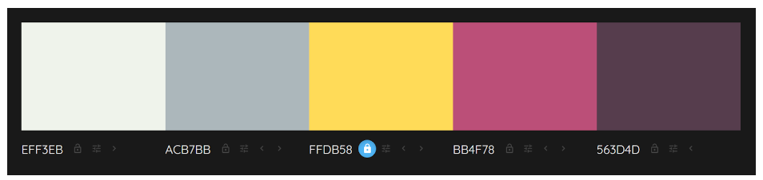

### Wireframes

The wireframes below were created using [figma](https://www.figma.com/). The layout for each of the pages has been designed to suit mobile, tablet, and desktop devices.

#### **Homepage**

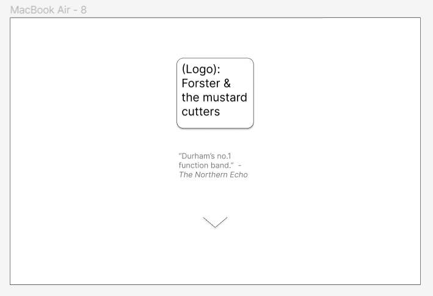

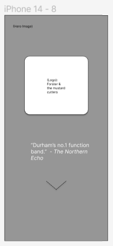

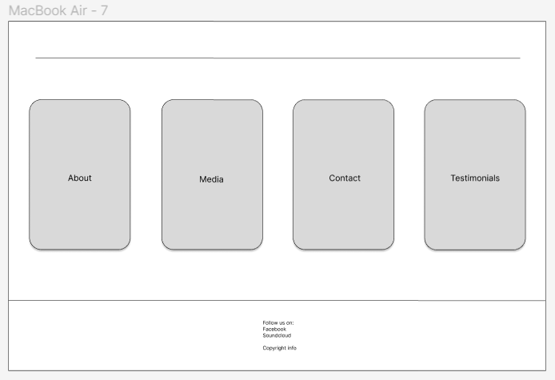
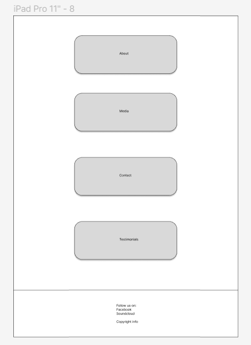

 

#### **About**

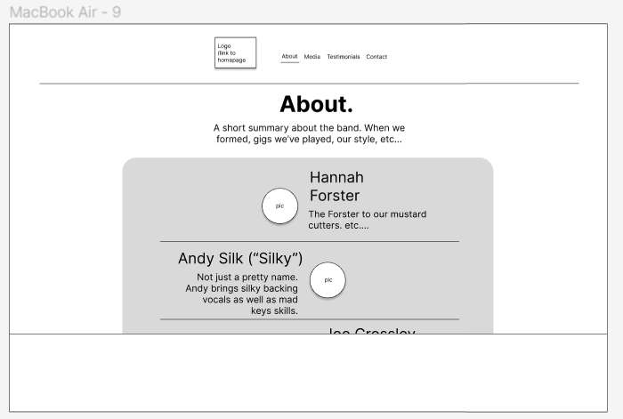
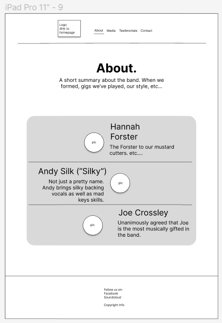
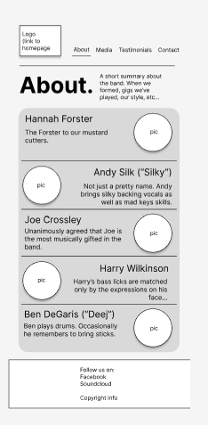

 

#### **Media**

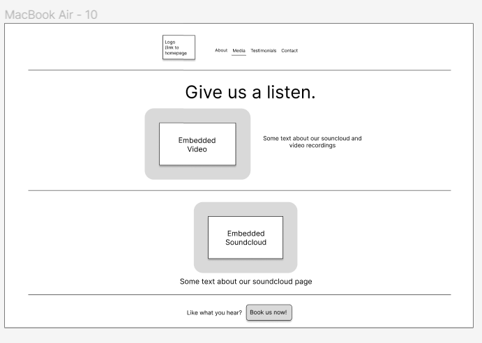
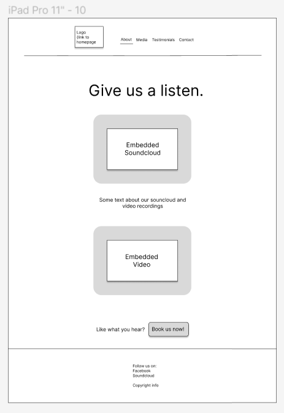
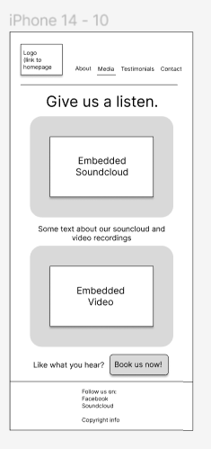

 

#### **Reviews**

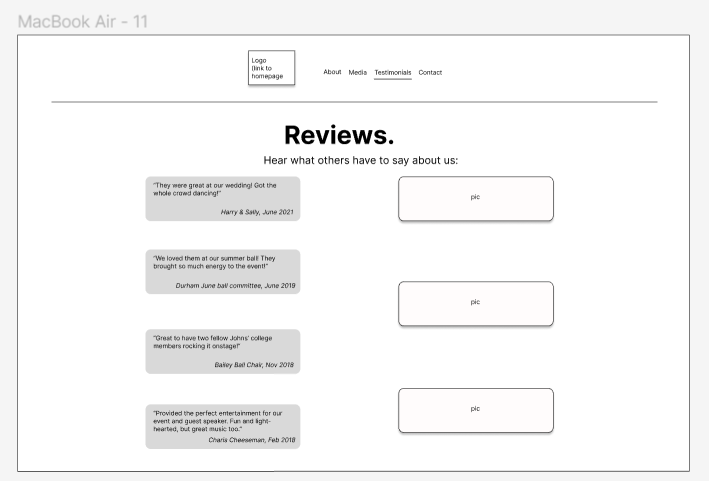
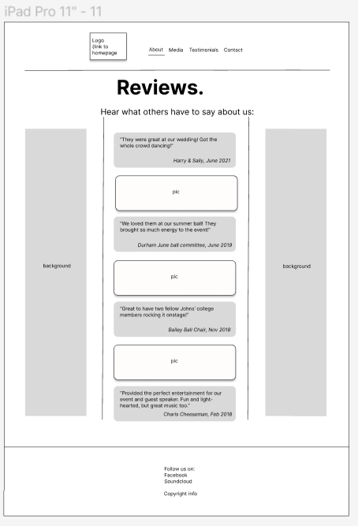

 

#### **Contact**

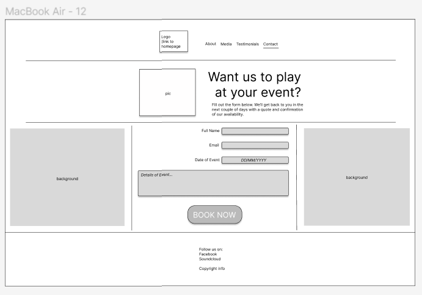
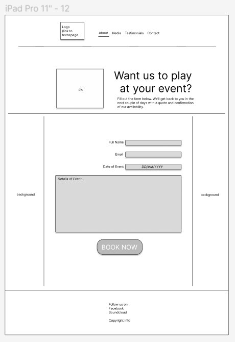
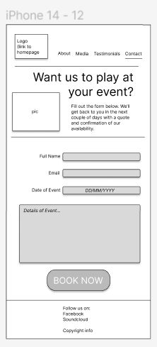

 

## Features

## Technologies Used
### Languages used
HTML, CSS

### Other programs used
* Wireframes: [figma](https://www.figma.com/)
* Version control: [Git](https://git-scm.com/)
* Saving and storing files: [GitHub](https://github.com/)
* IDE used to write HTML and CSS: [GitPod](https://gitpod.io/)
* Colour palate generator used in the site's design: [colormind.io](http://colormind.io)
* Fonts used on the website: [Google Fonts](https://fonts.google.com/)

## Deployment & Local Development

## Testing
### Debugging
### Validation
#### **HTML**
All HTML pages were validated using the [w3c vaildation service](https://validator.w3.org/). All pages passed with no errors and no warnings.

    
Home page

    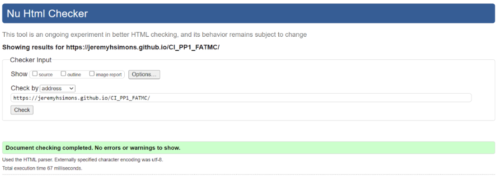

 

    
About page

    

 

    
Media page

    

 

    
Reviews page

    

 

    
Contact page

    

 

#### **CSS**
#### **Accessibility**
#### **Performance**
### Testing user stories
### Bugs

## Credits
* Thanks to my Mentor Mo Shami for his feedback, advice and encouragement throughout this project.
* Thanks to the wonderful CI slack community for helping me troubleshoot various bugs.
* Thanks to the CI London community, Namely Harry Dhillon, Ben Dawson, and Richard Lovett for making me feel welcome at code institute and for offering to help with fixing code issues. 
### 3rd party code used
* Google Fonts.
* Fontawesome Characters.
* The embedded soundcloud player was copied from Soundcloud.com (https://soundcloud.com/andrew-silk-743237145/isnt-she-lovely). 
    - I clicked on the 'share' button underneath the player.

        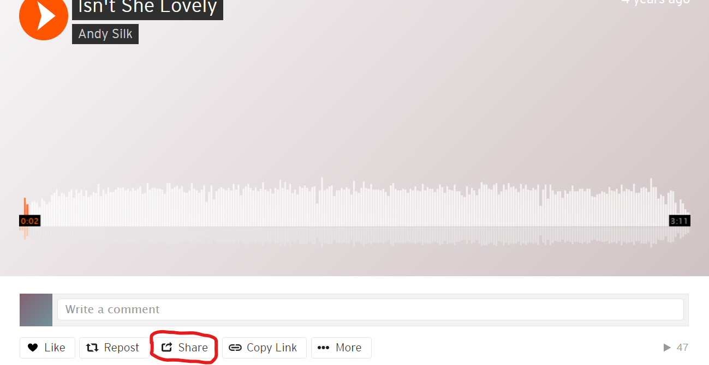

    - I clicked on the 'embed' tab.

        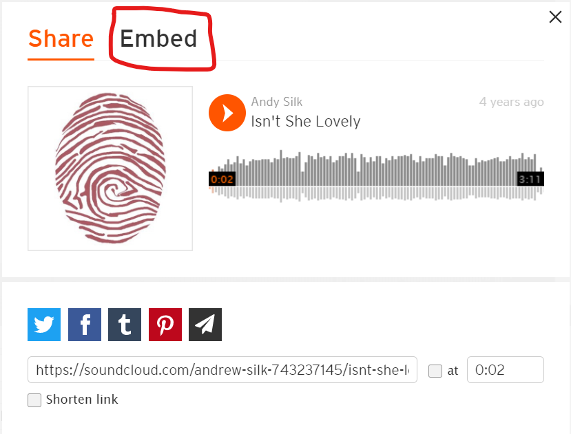

    - I copy/pasted the iframe element provided and pasted into my own code.

        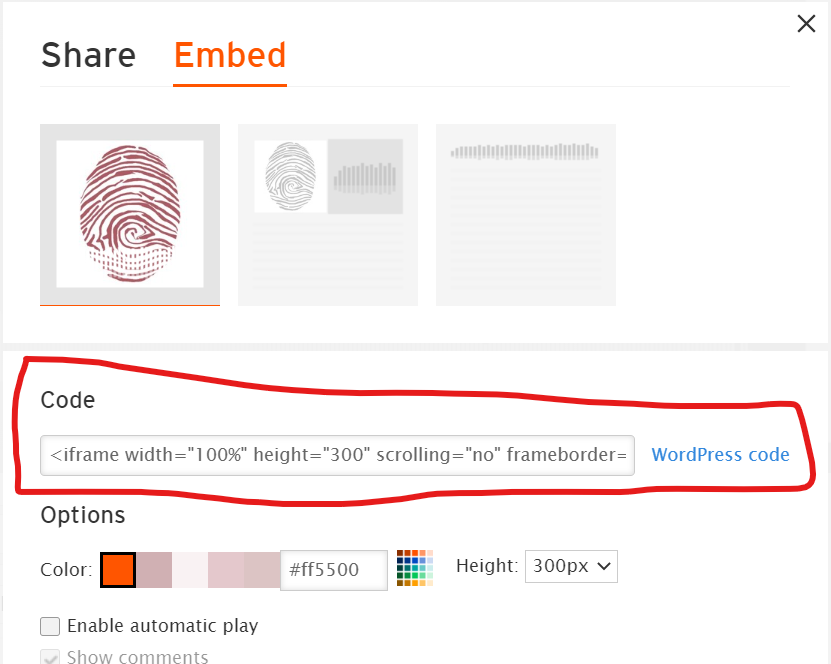
    
    - I deleted the allow="autoplay" attributes as well as the obsolete inline CSS in the iframe element, and added aria labels to the extra soundcloud links that appear in the code.

    - I also moved the inline CSS in the anchor elements nested in the iframe to the style.css file.

### Media
* Most images were sourced from the band's facebook page with permission from the page owner. Some were sent to me directly by band members (again with their permission) via private messaging on WhatsApp.
* The video which appears in the media page was also sent to me directly by one of the band members and is used on this site with permission.