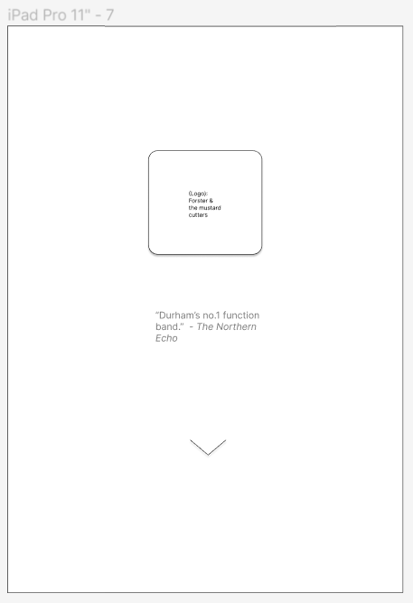
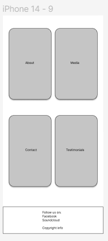
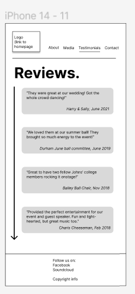
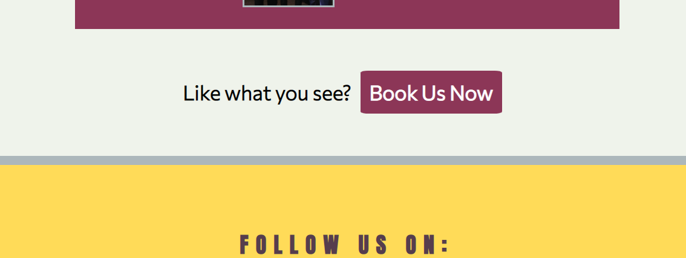
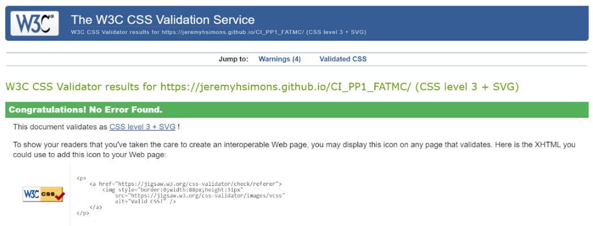

# **Forster and the Mustard Cutters**
developed by Jeremy Simons (Saxophonist in FATMC)

## Introduction
Having a strong online presence is a must for any serious musician in the 21st century. As well as generating social media followings, many musicians rely on sleek and stylish websites to act as a one-stop shop for any professional or business interaction they might have. SiteBuilderReport has listed some of the most effective [Websites](https://www.sitebuilderreport.com/inspiration/musician-website-examples?a=ga&keyword=musician%20websites&ad=574357467827&gclid=CjwKCAiApvebBhAvEiwAe7mHSDz1iMLpK8_tTCcjodhHX_uALxVNPRLPNiTwbmQ1u95UPJYPdK6PIhoCHvYQAvD_BwE) used by popular musicians today and common features include:
* Links to social media accounts.
* A store for purchasing merchandise.
* Links or embedded video for Listening to and watching the musician or band perform.
* A contact form for general/booking enquiries.

Forster and the Mustard Cutters is a Durham-based function band with lots of experience playing at live events such as parties, conferences, and university balls. They are looking to drum up more interest in their services and get more gigs. This site aims to provide them with a way to showcase their skills in an attractive and professional manner, and make it easy for site visitors to book their services. 

## Contents
* [Project Goals](#project-goals) 
    * [For the user](#for-the-user)
    * [For the site owner](#for-the-site-owner)
* [User Experience](#user-experience) 
    * [Target audience](#target-audience)
    * [User requirements](#user-requirements)
    * [User Stories](#user-stories)
* [Design](#design)
    * [Design Summary](#design-summary)
    * [Colour Scheme](#colour-scheme)
    * [Wireframes](#wireframes)
* [Features](#features)
* [Technologies Used](#technologies-used)
* [Deployment & Local Development](#deployment--local-development)
* [Testing](#testing)
    * [Validation](#validation)
        * [HTML](#html)
        * [CSS](#css)
        * [Accessibility](#accessibility)
        * [Performance](#performance)
    * [Testing user stories](#testing-user-stories)
    * [Bugs](#bugs)
* [Credits](#credits)

## Project Goals

### ...For the user
1. To find out whether I like this band and want them to play at my event.
1. To easily navigate their site to find relevant information.
1. To have an enjoyable experience using their site.
1. For all links to external media to work as expected.
1. For there to be an easy way to contact the band.
1. To access the website on a phone, tablet, or desktop.

### ...For the site owner
1. To promote the band/have an avenue to receive more bookings.
1. To promote the band's social media presence.
1. To entertain visitors to the website.

## User Experience

### Target audience
Potential users of the site may include, but are not limited to:
* Students or student organisations at Durham University planning events.
* Professional event organisers at the university.
* Younger couples planning their wedding/party.
* Local businesses planning a corporate event.
* Older users planning a significant birthday party/family event.

The potential users could be a very diverse group of people. Therefore it is important that the site is:
1. Fully responsive because a range of devices could be accessing it.
1. Free from accessibility issues.

### User requirements
This website must:
* Showcase pictures and other media of the band performing.
* Contain information about the music they play.
* Contain content to persuade visitors to book the band for a gig.
* Be easy to navigate to the relevant information.
* Feature a way to contact the band/a way for the band to receive bookings.
* Work on multiple devices/screen widths and browsers.
* Be accessible to users with visual impairment.

### User Stories

As a **first-time visitor** I want to:
* Easily access information about the band so that I can decide if I want to book them for my event.
* See pictures and access media of the band playing so that I can:
    1. See if the band are good at playing music.
    1. Decide if they are the right fit for my event.
* Easily contact the band so that I can enquire about booking them for my event.
* Have a pleasureable experience on the band's site so that I can feel confident in booking them.

As a **frequent visitor** I want to:
* Be able to return to view contact information so that I can make a repeat booking.
* Easily access social media links so that I can keep up with new media uploads and posts about the band.
* Easily share the band website or social links with my friends if I want to recommend them for my friend's event.

As a **website owner** or **band member** I want to:
* Have an attractive band website so that I can market my services as a musician to prospective clients and present our brand.
* Have an avenue that prospective clients can reach out to me without attracting spam.
* Have a place where I can showcase the band’s playing so that I can prove that we are worth hiring.

## Design

 

### Design Summary
The aim of this website's design is to make the customer feel like this band is fun and lighthearted whilst also being professional and easy to work with. This influenced both the colour scheme chosen for the website and the layout which are described below.

### Colour Scheme
Colormind.io was used to generate the colorscheme for this website. A key color that was included in this was the hex value #FFDB58 which is the mustard colour. This 'mustard' tone colour linked the website's design to the band's name and branding. 

The warm colors were chosen to give the user a sense of this being a friendly and fun band who are good to work with and who can generate a positive atmosphere when performing at a party/event.

The following is a screenshot of the colour scheme chosen however, due to accessibility issues with text/background, #BB4F78 was changed to a darker shade of maroon: #8C3657.

### Fonts
The fonts chosen for the website were Anton for headings and Commissioner for the main bodies of text on the website. Each of these were imported using [Google Fonts](https://fonts.google.com/). Sans-serif was chosen as the back-up font - in case these fonts don't load - because of it's clear readability.

### Page layout
The whole site has a clear, and easy-to-use layout with a logo/home page link in the top left and navigation bar in the top right of the page. Each page has a footer with social media links. Every anchor element that the developer has coded lights up or changes colour when hovered over or tapped to help the user feel that the site responds to their actions.

### Wireframes

The wireframes below were created using [figma](https://www.figma.com/). The layout for each of the pages has been designed to suit mobile, tablet, and desktop devices.

#### **Home page**

 

#### **About**

 

#### **Media**

 

#### **Reviews**

 

#### **Contact**

 

## Features
The website has 6 pages and the features of each page are listed below:

    
Home page

    
The home page consists of a landing page with a hero image of the band and an 'enter site' button to scroll down to the home page navigation section. This immediately introduces the user to the band and their branding and is a <a href="https://www.sitebuilderreport.com/inspiration/musician-website-examples?a=ga&keyword=musician%20websites&ad=574357467827&gclid=CjwKCAiApvebBhAvEiwAe7mHSDz1iMLpK8_tTCcjodhHX_uALxVNPRLPNiTwbmQ1u95UPJYPdK6PIhoCHvYQAvD_BwE" target="_blank" aria-label="a link to article from the introduction about musicians sites. Opens in a new tab">common feature</a> of artist sites. There is also a footer linking the user to the band's social media pages.

    <ul>
        <li>
            
Landing page with 'enter site' button to prompt user to access navigation to other pages.

            
        </li>
        <li>
            
Home navigation bar to direct user to other pages in the site

            
        </li>
        <li>
            
Site footer with links to the band's social media site.

            
        </li>
    </ul>

 

    
About page

    
The about page contains a short introduction to the band and a friendly photo of all the band members together at a recent performance. It also contains some silly and humourous biographies of the band members. These features help the user to get to know the band better and help the band market their brand to potential clients.

    <ul>
        <li>
            
The navbar and logo that appears on all pages of the site except home page.

            
        </li>
        <li>
            
A short introduction to the band.

            
        </li>
        <li>
            
Short biographies and profile photos of the band members.

            
        </li>
        <li>
            
A button at the bottom of the page that links directly to the contact page (i.e. a call to action). This feature also appears in the media and review pages.

            
        </li>
    </ul>

 

    
Media page

    
The media page contains a short summary of the style of music the band plays, a video of the band performing, and a soundcloud player of the band performing. This enables the band to showcase their music and the user to sample the band's services.

    <ul>
        <li>
            
A short introduction to the band's musical repertoire

            
        </li>
        <li>
            
A video of the band playing at a live event.

            
        </li>
        <li>
            
An embedded soundcloud player that plays a recording of a live performance.

            
        </li>
    </ul>

 

    
Reviews page

    
The reviews page contains a series of testimonials from previous customers about the band's services. It also contains more images of the band performing. These features help the band to persuade customers to hire them, and helps users feel more confident that the band is worth hiring.

    <ul>
        <li>
            
A series of short testimonials and pictures from recent events.

            
        </li>
    </ul>

 

    
Contact page

    
The contact page is where the user is directed if they follow the normal nav controls or click the 'book now' button at the bottom of the reviews/media/about pages. It features a contact form with a submit and reset button. This enables the user to feel that they can easily contact the band. It also provides the band with an official easy-to-keep-track-of method to get bookings.

    <ul>
        <li>
            
The form on the website's contact page.

            
        </li>
        <li>
            
The submit and reset button at the bottom of the contact form.

            
        </li>
    </ul>

 

    
Thanks/form submit page

    
The thanks page is where the user is directed if they successfully complete all form fields and submit their booking. It is simple and features a thanks message and a promise that the band will get back to them. The time-bound message helps the user to feel confident about when to expect a response, and gives the band/site owner time to respond appropriately.

    <ul>
        <li>
            
Thanks message that appears upon form submission.

            
        </li>
    </ul>

 

## Technologies Used
### Languages used
HTML, CSS

### Other tools/websites/libraries used
* [figma](https://www.figma.com/) was used to create wireframes.
* [Git](https://git-scm.com/) was used for version control.
* [GitHub](https://github.com/) was used for saving and storing files.
* [GitPod](https://gitpod.io/) was the IDE used for writing and editing code.
* [colormind.io](http://colormind.io) was used to generate the colour palate for the site.
* [Google Fonts](https://fonts.google.com/) was used for the fonts on the website.
* [Font Awesome](https://fontawesome.com/) was used to generate social media icons in the site.
* [Favicon.io](https://favicon.io/) was used to generate the site's favicon.
* [Soundcloud](https://soundcloud.com/) was used to generate an embedded media player.
* [amiresponsive]() was used to test the website across different screens and generate the picture in the [Design](#design) section.
* Google Chrome Developer Tools was used to debug the website.
* [Lighthouse](https://developers.google.com/web/tools/lighthouse) within Chrome's Developer Tools was used to test the website's performance. 
* The W3 validators for [HTML](https://validator.w3.org/) and [CSS](https://jigsaw.w3.org/css-validator/) were used to test the website's code.
* The WebAIM [WAVE](https://wave.webaim.org/) tool was used to test accessibility.

## Deployment & Local Development
The website was deployed to GitHub pages using the following process:
1. In the repository selecting the 'settings' tab.
2. In the left-hand aside, selecting the pages option.
3. Next, for the 'source' dropdown, make sure 'deploy from a branch' is selected, and 'main' is selected in the dropdown menu directly below.
4. Click save and wait a few minutes for the page to refresh. At the top of the page there should now be a url to the site: https://jeremyhsimons.github.io/CI_PP1_FATMC/ 

This repository can be forked using the following process:
1. On the repository's page, go to the top-right of the page underneath the dark ribbon.
1. Click on the fork button
1. You can now work on a fork of this project. 

This repository can be cloned using the following process:
1. Go to this repository's page on GitHub.
1. Click on the code button (not the one in the navbar, but the one right above the file list).
1. Select an option, HTTPS, SSH, GitHub CLI.
1. Copy the url below to your clipboard.
1. Open Git Bash/your IDE terminal.
1. Ensure the directory you are working in is the correct one you want to paste the project into.
1. Type the command '$ git clone'
1. Paste the URL of the repository after this.
1. Hit enter on your keyboard and the project will be cloned.
 

## Testing
### Debugging
The site was debugged using Google Chrome Developer tools. The site was also tested using the following browsers: 
* Google Chrome
* Mozilla Firefox
* Microsoft Edge

The site was tested on the following devices:
* Lenovo Ideapad 520S (Windows 10)
* Huawei PSmart 2019 (EMUI version 12.0.0)

### Validation
#### **HTML**
All HTML files were validated using the [w3c vaildation service](https://validator.w3.org/). All pages passed with no errors and no warnings.

    
Home page

    

 

    
About page

    

 

    
Media page

    

 

    
Reviews page

    

 

    
Contact page

    

 

    
Form submit/thanks page

    

 

#### **CSS**
The stylesheet for this website was validated using the W3C [Jigsaw](https://jigsaw.w3.org/css-validator/) CSS validation service. The file contained no errors.

#### **Accessibility**
The site's accessibility was tested using the [WAVE](https://wave.webaim.org/) tool by webaim. All pages passed with no errors or contrast errors.

    
Home page

    

 

    
About page

    

 

    
Media page

    

 

    
Reviews page

    

 

    
Contact page

    

 

#### **Performance**
The performance of the website was tested using Lighthouse within Chrome developer tools. The tests below were for desktop devices and all pages acheived a score above 90/100 for the criteria of performance, accessibility, best practices, and SEO.

    
Home page

    

 

    
About page

    

 

    
Media page

    

 

    
Reviews page

    

 

    
Contact page

    

 

### Testing user stories
### Bugs

| Bug Description  | Action Taken to Fix  |
|---|---|
| When homepage is viewed on mobile screen flipped sideways, the logo and quote spill into the nav element. | Add a min-heigh style rule to the hero image element. |
| When viewing home page on a sideways-mobile screen, the homepage nav element spills into the footer | Add a min-height style rule to the parent element of the navigation elements.|
| When viewing the contact page in Firefox the textarea overflows the form element horizontally.| Add a max-width rule of 265px targeting the textarea element.|
| When viewing the about/media/reviews/contact page on amiresponsive navbar text would wrap. | Create a media query for screens under a width of 320px to adjust size and positioning of navbar text to avoid potential breaking of page on unexpectedly small screen.|

### Known Bugs

On Google Chrome on the Huawei PSmart 2019 (EMUI android) device, the drop-down searchbar from the browser causes fixed backgrounds to move up and down occasionally which can be distracting when scrolling down the home page, review page, and contact page. 

Since the bug has a very limited impact on the user's ability to use the site and will only affect a subset of users, this bug was not addressed given the time limitations of the developer for this project.

## Credits
* The 404 page was created with the help of GitHub's [instructions](https://docs.github.com/en/pages/getting-started-with-github-pages/creating-a-custom-404-page-for-your-github-pages-site) on how to create a custom 404 page.

### 3rd party code used
* Google Fonts.
* Fontawesome Characters.
* The embedded soundcloud player was copied from Soundcloud.com (https://soundcloud.com/andrew-silk-743237145/isnt-she-lovely). 
    - I clicked on the 'share' button underneath the player.

         

    - I clicked on the 'embed' tab.

         

    - I copy/pasted the iframe element provided and pasted into my own code.

         
    
    - I deleted the allow="autoplay" attributes as well as the obsolete inline CSS in the iframe element, and added aria labels to the extra soundcloud links that appear in the code.

    - I also moved the inline CSS in the anchor elements nested in the iframe to the style.css file.

### Media
* Most images were sourced from the band's facebook page with permission from the page owner. Some were sent to me directly by band members (again with their permission) via private messaging on WhatsApp. 
* The following images (which are not of the band) were found:
    1. Durham Castle at night time: [Wikimedia](https://commons.wikimedia.org/wiki/File:The_Keep_and_Gatehouse_of_Durham_Castle_at_night.jpg )
    1. Durham Cathedral at night time: [Branipick](https://places.branipick.com/durham-cathedral-last-night-in-the-royal-colour/)
* The video which appears in the media page was also sent to me directly by one of the band members and is used on this site with permission.

### Acknowledgements
* Thanks to my Mentor Mo Shami for his feedback, advice and encouragement throughout this project.
* Thanks to the wonderful CI slack community for helping me troubleshoot various bugs, as well as for help with creating a form submission thanks page.
* Thanks to the CI London Community, Namely Harry Dhillon, Ben Dawson, and Richard Lovett for making me feel welcome at Code Institute and for offering to help with fixing code issues.
